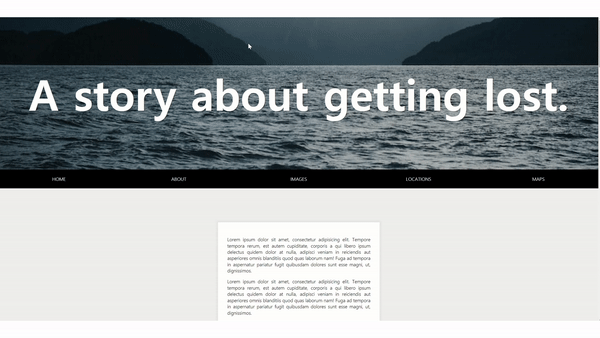

# Sticky Nav

<br>



## 소개

- 내비게이션 바가 브라우저 상단에 부딪히는 경우 그 이후로 스크롤을 내릴 때 상단에 바가 고정이 가능한 웹페이지

## 배운내용

전체코드

```js
const nav = document.querySelector("#main");
const topOfNav = nav.offsetTop;

function fixNav() {
  if (window.scrollY >= topOfNav) {
    document.body.style.paddingTop = nav.offsetHeight + "px";
    document.body.classList.add("fixed-nav");
  } else {
    document.body.style.paddingTop = 0;
    document.body.classList.remove("fixed-nav");
  }
}

window.addEventListener("scroll", fixNav);
```

### No HardCoding

1. **내비게이션 바 고정**

- window.ScrollY : 스크롤 할 때마다 스크롤이 얼마나 되었는지 px 단위로 알려준다.
  (현재 화면의 최상단이, 전체 페이지의 최상단으로부터 얼마만큼 아래로 움직였는지)

- topOfNav : 브라우저의 최상단으로부터 내비게이션바가 얼마나 떨어져있는지에 대한 px 값이다.

  스크롤을 하면서 내비게이션 바가 현재 화면 최상단에 부딪힐때부터 바가 고정이 되야하므로

  window.ScrollY >= topOfNav 일때 body에 `fixed-nav` 클래스를 추가하였고,

  ```css
  .fixed-nav nav {
    position: fixed;
    box-shadow: 0 5px rgba(0, 0, 0, 0.1);
  }
  ```

  이렇게 바를 고정시킬 수 있게 되었다.

  하지만 문제가 있다.

  

  이렇게 스크롤을 내릴 때 순간 아래 내용들이 갑자기 위로 튀어나오는 현상을 볼 수 있는데 이는

  스타일을 `position: fiexd` 하는 순간 nav바가 공간을 차지하지 않아 붕 떠있는 상태가 되어버려, 다른 요소들이 빈 공간을 차지하기 위해 튀어오르는 것이다.

  따라서,

  ```js
  function fixNav() {
    if (window.scrollY >= topOfNav) {
      document.body.style.paddingTop = nav.offsetHeight + "px";
      document.body.classList.add("fixed-nav");
    } else {
      document.body.style.paddingTop = 0;
      document.body.classList.remove("fixed-nav");
    }
  }
  ```

  이렇게 위에 `padding-top`을 내비게이션 바의 높이만큼 주었고, fixed가 해제될때는 다시 0 값을 주었다.

  여기서 중요한 것은 `padding-top`이 값을 설정할 때, **css**에 **절대적인 숫자값**이 아닌 **JS**를 이용해 **변수**인 내비게이션 바의 높이를 할당했다는 것이다.

  내비게이션 바의 높이는 **언제든지 바뀔 수 있기 때문**이다.

2. **바 좌측에서 로고 튀어나오게 하기**

```css
li.logo {
  max-width: 0;
  overflow: hidden;
  background: white;
  transition: all 0.5s;
  font-weight: 600;
  font-size: 30px;
}

.fixed-nav li.logo {
  max-width: 500px;
}
```

추가적으로 로고를 왼쪽에서 튀어오르게 하는 기능을 구현했는데 이때 `width`가 아닌 `max-width`를 사용한 점이 중요하다.

`width` 값을 0에서 auto로 변화시켜 애니메이션을 구현하는 것은 불가능하다.

따라서 이러한 효과를 구현할 때는 로고를 미리 만들어두고, `overflow : hidden`을 설정한 후, `max-width : 0`을 유지하다가, 일정 조건을 만족하면 `max-width`의 값을 증가하는 방향으로 완성해보자.

## [링크](https://tranquil-cupcake-40d259.netlify.app)

## 참고자료

https://iborymagic.tistory.com/49
