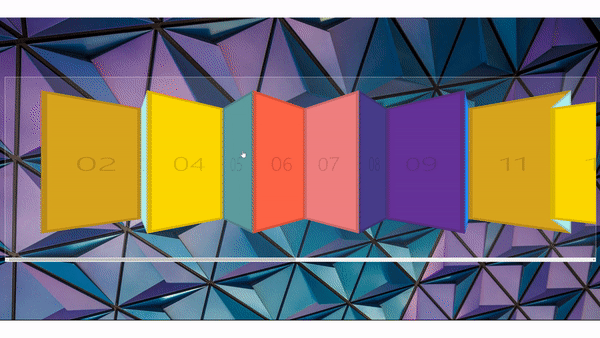

# Click and Drag to Scroll

<br>



## 소개

- 마우스로 드래그해서 스크롤 할 수 있는 기능을 구현한 웹페이지

## 배운내용

전체코드

```js
const slider = document.querySelector(".items");
let isDown = false;
let startX;
let scrollLeft;

slider.addEventListener("mousedown", (e) => {
  isDown = true;
  slider.classList.add("active");
  startX = e.pageX - slider.offsetLeft;
  scrollLeft = slider.scrollLeft;
});
slider.addEventListener("mouseleave", () => {
  // 마우스가 item들을 벗어난 경우
  isDown = false;
  slider.classList.remove("active");
});
slider.addEventListener("mouseup", () => {
  isDown = false;
  slider.classList.remove("active");
});
slider.addEventListener("mousemove", (e) => {
  if (!isDown) return; // 클릭 상태일때만 호출
  e.preventDefault(); // 드래그 시 텍스트를 클릭하는 현상 방지
  const x = e.pageX - slider.offsetLeft;
  const walk = x - startX;
  slider.scrollLeft = scrollLeft - walk;
});
```

### 핵심은 드래그 할때마다 변하는 좌표를 `x` 에서 처음 클릭 시 좌표인 `startX` 를 뺀 `walk` 값을 `scrollLeft` 에 대입해서 스크롤을 하는것이다.

### 1) 사용된 여러가지 좌표관련 변수들

- 클릭 이벤트 에서 사용할 수 있는 위치 속성

  - **clientX, clientY**

    - 위 메서드는 클라이언트 영역 내의 가로,세로 좌표를 제공한다. 여기서 클라이언트 영역은 **현재 보이는 브라우저 화면이 기준**이 된다.
    - 페이지의 **스크롤**을 신경쓰지 않는다.

      

  - **offsetX, offsetY**

    - **요소 영역을 기준**으로 좌표를 표시한다.

      

  - **pageX, pageY**

    - **스크롤을 포함**한 페이지를 기준으로 좌표를 표시한다.

      

  - **screenX, screenY**

    - 모니터(스크린)을 기준으로 좌표를 표시한다.

      

- **scrollLeft** : 스크롤을 오른쪽으로 얼마나 했는지에 대한 값을 px로 나타냄. 즉, 스크롤 막대가 오른쪽으로 갈수록 +, 왼쪽으로 갈수록 -, 맨 처음 스크롤을 하지 않고 그대로인 경우는 0

여기서는 페이지 전체 기준 X 좌표(pageX)에서 items div의 왼쪽 가장자리의 X 좌표만큼을 빼주는 방법을 선택했다.

그렇게 하면 items div의 왼쪽 가장자리를 기준으로 한 X 좌표를 가져올 수가 있기 때문.

offsetX를 사용하지 않은 이유는, 이벤트가 발생하는 요소가

items 전체 요소가 아니라 내부에 포함된 item 각각이 될 수 있기 때문이다.

### 2) 드래그 후 클릭시 문제

```js
const x = e.pageX - slider.offsetLeft;
const walk = x - startX;
slider.scrollLeft = walk;
```

하지만 이 상태에서 드래그 후 다시 클릭을 하면, 스크롤이 맨 왼쪽에서 다시 시작한다.

이유는 `startX`와 `x` 모두 초기화되서 `walk`또한 0 부터 다시 시작하니까 `scrollLeft` 또한 0부터 시작하기 때문이다.

따라서

```js
slider.scrollLeft = scrollLeft - walk;
```

`scrollLeft`값에서 `walk` 값을 빼준값으로 매번 갱신하면, 다시 클릭했을때에도 `scrollLeft` 값에 스크롤값이 남아있어서 처음으로 되돌아가지 않는다.

### 3) offsetLeft

`offsetLeft`가 의미하는 바를 고민하다가 콘솔에 찍어보니 어떤 곳을 클릭하거나 드래그하여도 계속 0 값을 출력하는 것을 알아냈다. 그래서 이 값을 빼도 웹페이지가 정상적으로 동작되는데 왜 넣은걸까..?


찾아보니 부모 영역을 기준으로 얼마나 떨어져 있는지를 나타낸다. 그렇다면 `scrollLeft`는 `body`의 왼쪽 상단 모서리에서 `slider`의 왼쪽 상단 모서리까지의 거리를 나타낸다.

`items` 의 부모는 `body`이고 흰색 테두리 선 안 뿐만아니라 화면 전체를 나타낸다면, 0px이 나올 수는 없는데 어떻게 나오는 것일까..?

신기한건 `scrollTop`의 값은 100px정도로 나온다.

그러던중 `margin` 값이 `scrollLeft` 값과 같아진다는 사실을 발견했다.

그러나 아직 직관적으로 의미를 잘 모르겠다.. 나중에 비슷한 경우가 나온다면 그때 다시 공부하기로!
`
<br/>
<br/>
<br/>

---

마지막에 드래그로 스크롤을 하고 다시 클릭을 했을때 처음으로 돌아오는 경우를 해결하는 부분이 이해가 안갔다.

그래도 처음봤을때 엄청 어려운 기능으로 생각했는데 코드가 예상보다 짧고 그리 복잡하지 않아서 다행이라고 생각했다.

## [링크](https://cool-blini-4db3da.netlify.app)

## 참고자료

https://iborymagic.tistory.com/52

https://developer.mozilla.org/en-US/docs/Web/API/Element/scrollLeft

https://mong-blog.tistory.com/entry/clientX-offsetX-pageX-screenX-%EC%B0%A8%EC%9D%B4

https://ko.javascript.info/size-and-scroll
