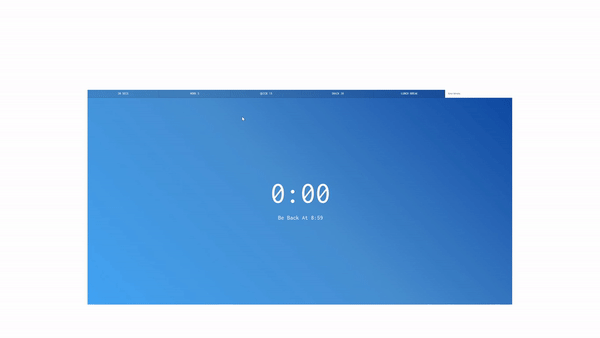
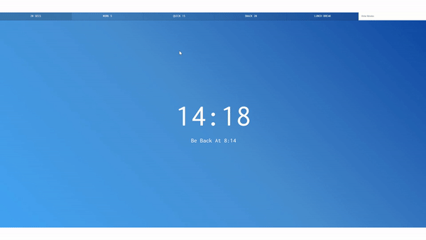

# Countdown Timer

<br>



## 소개

- 사용자가 원하는 시간만큼의 타이머를 설정하고, 남은시간이 얼마나 남았는지 알려주는 시계를 구현한 웹페이지

## 배운내용

전체코드

```js
let countdown; // 타이머 개수
const timerDisplay = document.querySelector(".display__time-left");
const endTime = document.querySelector(".display__end-time");
const buttons = document.querySelectorAll("[data-time");

function timer(seconds) {
  // 이전에 존재하는 타이머 모두 삭제
  clearInterval(countdown);

  const now = Date.now();
  const then = now + seconds * 1000; // seconds초 후시간
  displayTimeLeft(seconds);
  displayEndTime(then);
  countdown = setInterval(() => {
    const secondsLeft = Math.round((then - Date.now()) / 1000); // 남은시간
    if (secondsLeft < 0) {
      clearInterval(countdown);
      return;
    }
    displayTimeLeft(secondsLeft);
  }, 1000);
}

function displayTimeLeft(seconds) {
  const minutes = Math.floor(seconds / 60);
  const remainderSeconds = seconds % 60;
  const display = `${minutes}:${
    remainderSeconds < 10 ? "0" : ""
  }${remainderSeconds}`;
  document.title = display;
  timerDisplay.textContent = display;
}

function displayEndTime(timestamp) {
  const end = new Date(timestamp);
  const hour = end.getHours();
  const adjustedHour = hour > 12 ? hour - 12 : hour;
  const minutes = end.getMinutes();
  endTime.textContent = `Be Back At ${adjustedHour}:${
    minutes < 10 ? "0" : ""
  }${minutes}`;
}

function startTimer() {
  const seconds = parseInt(this.dataset.time);
  timer(seconds);
}

buttons.forEach((button) => button.addEventListener("click", startTimer));
document.customForm.addEventListener("submit", function (e) {
  e.preventDefault();
  const mins = this.minutes.value;
  timer(mins * 60); // 초로 전달해야 함
  this.reset();
});

timer(5);
```

### Date 객체 & claerInterval

- **남은 시간**

  ```js
  function timer(seconds) {
    const now = Date.now();
    const then = now + seconds * 1000;

    setInterval(() => {
      const secondsLeft = Math.round((then - Date.now()) / 1000);
      if (secondsLeft < 0) {
        return;
      }
    }, 1000);
  }
  ```

    

  사용자가 입력한 시간만큼의 타이머를 입력할 때 `Date`객체를 사용하면 편리하다.

  `Date.now()`를 통해 현재시간을 반환받는다.

  사용자가 입력한 시간 까지 **현재시간으로부터 남은 시간** = (처음 시점 시간 + 사용자가 입력한 초 \* 1000) - 매 초마다 현재시간이다.

  1000을 곱하는 이유는 `Date.now()`가 반환하는 초 값은 ms이기 때문이다.

<br/>
<br/>
<br/>
<br/>

- **끝나는 시간**

  ```js
  function displayEndTime(timestamp) {
    const end = new Date(timestamp);
    const hour = end.getHours();
    const adjustedHour = hour > 12 ? hour - 12 : hour;
    const minutes = end.getMinutes();
    endTime.textContent = `Be Back At ${adjustedHour}:${
      minutes < 10 ? "0" : ""
    }${minutes}`;
  }
  ```

    

  그리고 끝나는 시간이 언제인지 알기 위해 또 `Date`객체를 사용한다.

  `timestamp`값은 이전에 입력하였던 `then` 값 이고, new Date()에 인자로 밀리초 단위의 시간을 넣으면 날짜와 시간대를 가진 객체로 재탄생한다.

  따라서 이것을 객체의 함수인 `getHours()`, `getMinutes()` 등을 사용하면 특정 시간의 시간, 분, 초등을 반환받을 수 있다.

<br/>
<br/>
<br/>
<br/>
<br/>

- **타이머가 겹치는 문제**

    

  또한 버튼으로 구현한 타이머들을 여러 번 누르다보면 문제가 발생한다.

  타이머들이 겹쳐서 존재하기 때문이다.

  ```js
  function timer(seconds) {
    // 이전에 존재하는 타이머 모두 삭제
    clearInterval(countdown);

    const now = Date.now();
    const then = now + seconds * 1000; // seconds초 후시간
    displayTimeLeft(seconds);
    displayEndTime(then);
    countdown = setInterval(() => {
      const secondsLeft = Math.round((then - Date.now()) / 1000); // 남은시간
      if (secondsLeft < 0) {
        clearInterval(countdown);
        return;
      }
      displayTimeLeft(secondsLeft);
    }, 1000);
  }
  ```

  `clearInterval`을 통하여 현재 존재하는 타이머들을 모두 삭제하여 해결할 수 있다.

  이러한 타이머들의 개수를 담는 변수로 전역에 `countdown`변수를 두었고, 반환 값은 존재하는 타이머의 개수이다.

  따라서 버튼을 누를 때 마다 원래는 0, 1, 2, 3, ... 점점 증가하지만, `clerInterval`을 사용하여 하나의 타이머만 존재하도록 초기화 시키는 것이다.

<br/>
<br/>
<br/>

---

이제 하나 남았다!

## [링크](https://venerable-hummingbird-df4002.netlify.app)
