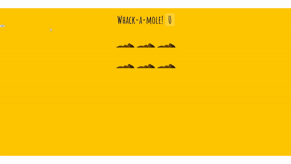

# Make a Whack A Mole Game

<br>



## 소개

- 두더지게임

## 배운내용

전체코드

```js
const holes = document.querySelectorAll(".hole");
const scoreBoard = document.querySelector(".score");
const moles = document.querySelectorAll(".mole");

let lastHole; // 가장 최근 구멍
let timeUp = false;
let score = 0;

function randomTime(min, max) {
  return Math.round(Math.random() * (max - min) + min);
}

function randomHole(holes) {
  const idx = Math.floor(Math.random() * holes.length);
  const hole = holes[idx];
  if (hole === lastHole) {
    // 두더지 중복 시 재귀
    return randomHole(holes);
  }
  lastHole = hole;
  return hole;
}

function peep() {
  const time = randomTime(200, 1000); // 0.2 ~ 1초
  const hole = randomHole(holes);
  hole.classList.add("up");
  setTimeout(() => {
    hole.classList.remove("up");
    if (!timeUp) peep(); // 시간이 남아있으면 계쏙 두더지 뽑기
  }, time);
}

function startGame() {
  scoreBoard.textContent = 0;
  timeUp = false;
  score = 0;
  peep();
  setTimeout(() => (timeUp = true), 10000); // 타이머 10초 설정
}

function bonk(e) {
  // 두더지 잡았을 때
  if (!e.isTrusted) return; // 반칙
  score++;
  this.parentNode.classList.remove("up");
  scoreBoard.textContent = score;
}

moles.forEach((mole) => mole.addEventListener("click", bonk));
```

겉으로 봤을때는 어려워 보이지만 어렵지 않았다.

다만 두더지가 올라오지 않았을 때와 올라왔을 때 두더지를 제대로 클릭했는지 어떻게 검사하는지가 궁금했다.

### isTrusted

우선 두더지가 올라오고 내려가는건 `up` 클래스를 추가/삭제 하여 두더지의 `top` 속성을 0% 또는 100%로 설정하였다.

하지만 올라온 두더지를 클릭으로 어떻게 감지할까?

이때 이벤트 객체안에 `isTrusted`로 문제를 해결할 수 있다.

사용자 작업에 의해 이벤트가 생성될 때와 스크립트가 이벤트를 생성하거나 수정하는 경우에 대한 값을 가지고 있다.

사용자 작업에 의해서 생성된 이벤트일 경우에는 true, 스크립트에 의해 생성된 이벤트일 경우에는 false를 갖는다.

즉, `e.isTrusted`는 자바스크립트로 가짜로 만들어 낸 클릭 이벤트가 아니라,

**사용자가 실제로 마우스로 클릭을 해서 만들어 낸 클릭 이벤트일 경우에만 true**가 된다.

```js
function bonk(e) {
  // 두더지 잡았을 때
  if (!e.isTrusted) return; // 반칙
  score++;
  this.parentNode.classList.remove("up");
  scoreBoard.textContent = score;
}
```

따라서 `isTrusted` 값은 두더지가 올라오지 않았을경우 클릭하면 false를 반환하고, 올라왔을때 클릭한 경우에만 true를 반환한다.

<br/>
<br/>
<br/>

---

## [링크](https://dainty-clafoutis-41049a.netlify.app)

## 참고자료

https://developer.mozilla.org/ko/docs/Web/API/Event/isTrusted
